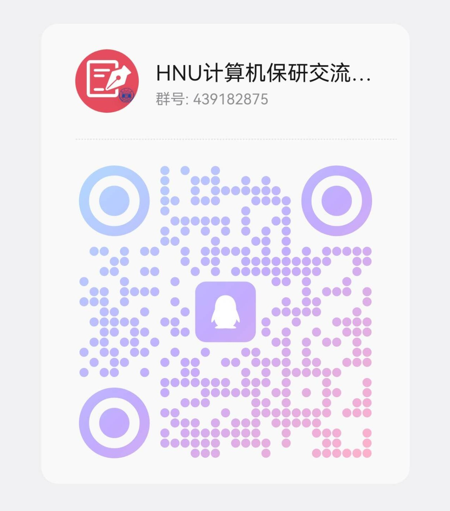

  <h1>湖南大学计算机保研指南</h1>
  
星光不负赶路人，时光不负有心人

  

    
    
    
  

---

## 为什么阅读这份指南？
- 汇集湖南大学历届同学的真实经历，覆盖推免流程全链路。
- 突出常见问题、院校信息与文书模板，少走弯路更高效。
- 信息按主题分类，支持快速搜索与在线协作更新。

## 快速上手
1. 浏览左侧目录，了解推免时间线与准备要点。
2. 打开上方徽章中的“快速开始”链接，按流程逐项推进。
3. 在搜索框输入目标院校/关键词，查看历史经验与材料。

> 🔍 小贴士：遇到想收藏的页面，可以点击右上角 GitHub 图标直接跳转编辑或下载原始 Markdown。

## 核心模块导航
<table>
  <tr>
    <td><strong>🚀 推免流程</strong> 从资格审查到复试、递补的全过程攻略。 <a href="guide/tui-mian-liu-cheng.md">立即查看</a></td>
    <td><strong>🏫 院校信息</strong> 热门高校夏令营与预推免要求、考核形式速览。 <a href="universities/bi-du.md">必读指南</a></td>
  </tr>
  <tr>
    <td><strong>📝 文书资料</strong> 个人陈述、推荐信、问答整理，另有 PPT/简历模板。 <a href="doc/wen-shu-zhun-bei.md">快速查阅</a></td>
    <td><strong>📦 资料下载</strong> 机试真题、面试题库、学术会议目录等合集。 <a href="other/README.md">集中下载</a></td>
  </tr>
</table>

## 推荐时间线
| 阶段 | 关键动作 | 建议时间 |
| --- | --- | --- |
| 信息收集 | 阅读推免流程、梳理目标院校名单 | 每年 3-4 月 |
| 能力准备 | 机试刷题、专业课/英文问答巩固 | 4-6 月 |
| 材料完善 | 完成简历、个人陈述、套磁邮件 | 6-7 月 |
| 报名应对 | 关注夏令营/预推免通知，准备面试 | 7-9 月 |
| 最终确认 | 跟进递补、提交最终材料 | 9-10 月 |

## 最新提醒
- 优先关注官网通知，结合往年经验及时调整策略。
- 若有新的经验分享或资料补充，欢迎提交 Issue/PR。

## 贡献方式
- 在 GitHub 发起 Issue/PR，或在交流群内联系维护同学协助上传。
- 投稿时注明专业、排名、去向及可公开的联系方式，方便后续同学交流。
- 欢迎加入维护，共同保持资源长期更新。

## 许可证
内容遵循 [CC BY-NC 4.0](https://creativecommons.org/licenses/by-nc/4.0/) 许可证，仅限非商业转载，使用时请注明出处。

## 联系方式

  
加入湖南大学计算机保研交流群：439182875

  

---

  
⭐ 如果本指南对你有帮助，欢迎 Star 并分享给更多同学。

